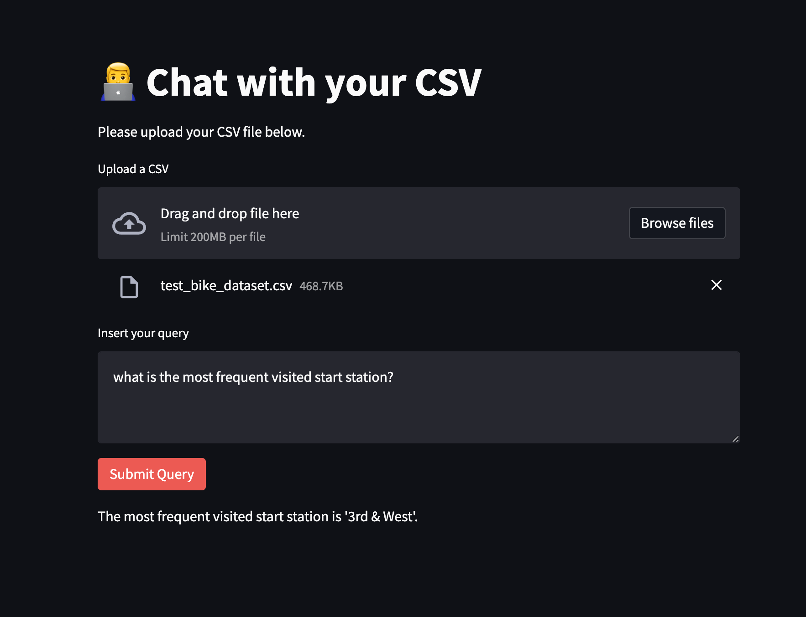
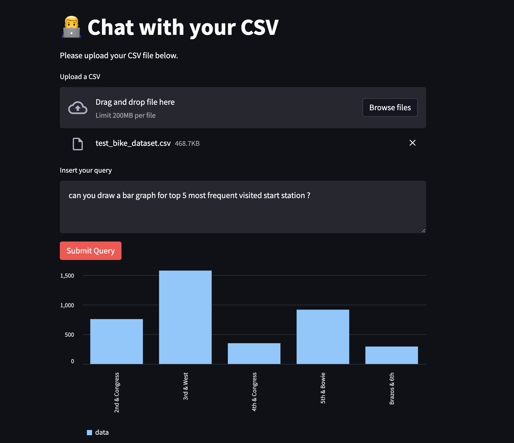
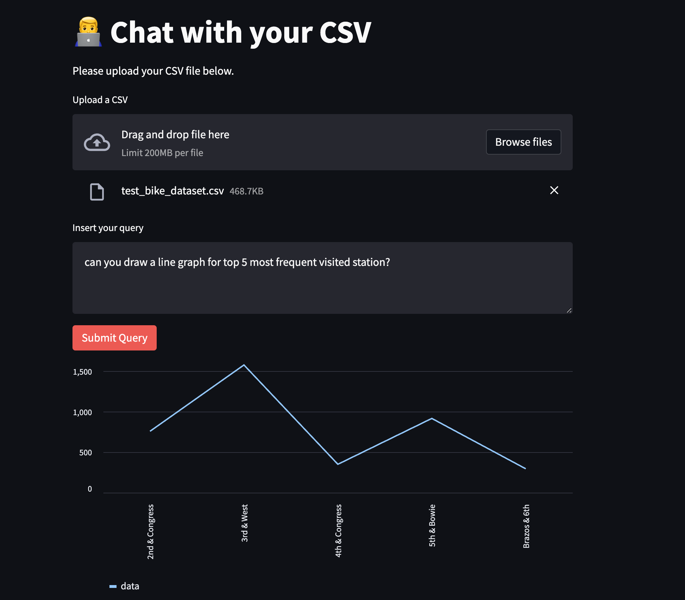
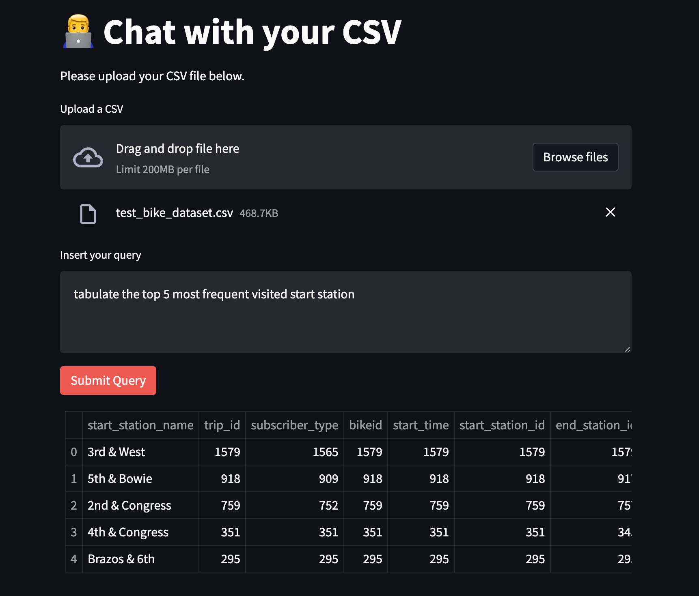

# Chat with your CSV: Visualize Your Data with Langchain and Streamlit
Install langchain and relevant packages

```
pip install langchain openai streamlit python-environ tabulate
```

## Requirements

Install the required packages by running

```
pip install -r requirements.txt
```

Create a .env file and add the keys into it as below:

```
apikey=your_openai_api_key
```

## Interface

---

---

---

